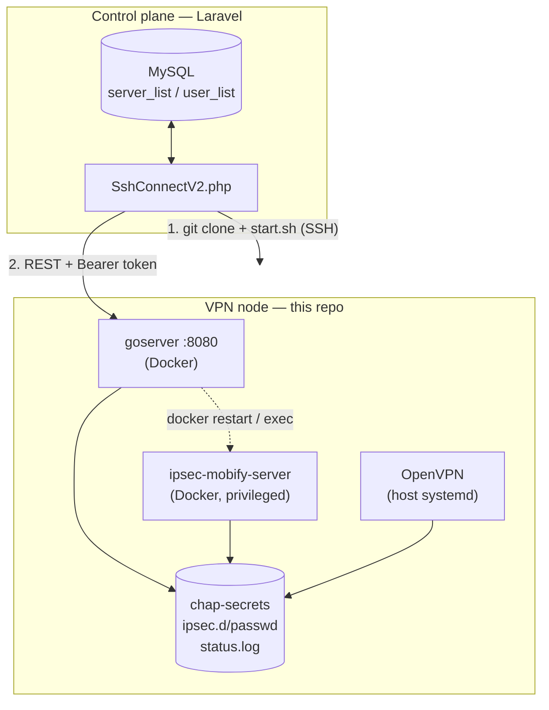

# Architecture

How the VPN node stack works, and how it fits into the wider VPNPro system.

This repository is **not deployed by hand**. It is cloned onto each VPN server by
the Laravel control panel — see [Provisioning](#1-provisioning-who-installs-this)
— so changes here affect every server provisioned from that point on.

---

## 0. The two halves

| | Control plane | Data plane (this repo) |
|---|---|---|
| **What** | Laravel backend (`vpnpro_main/backend`) | VPN node — one per country/location |
| **Where** | Central app server | Rented VPS boxes (OVH, Vultr, …) |
| **Talks via** | SSH (provisioning) + HTTP (management) | Exposes `goserver` on `:8080` |
| **Source of truth** | MySQL `server_list`, `user_list` | `chap-secrets`, `ipsec.d/passwd`, OpenVPN PKI |

The control panel never edits VPN config directly. It either runs shell commands
over SSH (install / restart) or calls the `goserver` HTTP API (users, bandwidth,
service restarts).



---

## 1. Provisioning — who installs this

Everything is driven by
[`app/Module/SshConnectV2.php`](../vpnpro_main/backend/app/Module/SshConnectV2.php)
in the Laravel backend. It authenticates over SSH with a **password** stored on
the `ServerListModel` row (`sshuser` / `password`), then:

**`addServer($ip)`** → `handleRoot()` or `handleNonRoot()` depending on whether
the SSH user is `root` (`SshConnectV2.php:431`):

1. `git clone https://github.com/levanmobify/vpnserver.git` into `/root` or `/home/$user`
2. Installs Docker CE + the compose plugin from `download.docker.com`
3. For non-root, `usermod -aG docker $user`
4. Uploads a generated `prod.yml` over SFTP — this is where the `goserver`
   API password comes from (`getYamlContent()`, `SshConnectV2.php:799`)
5. Runs `sudo ./start.sh` inside the cloned repo

**`addOpenVPN($ip)`** → `handleOpenVPN()` (`SshConnectV2.php:843`) installs
OpenVPN **separately**, on the host, then reads back the generated
`android.ovpn` / `windows.ovpn` and stores them on the server row so the mobile
apps can hand them to clients.

**`addUsers($ip, $userCount)`** POSTs a batch of generated usernames to
`http://$ip:8080/api/v1/users` and writes the returned credentials
(username / password / PSK) into `user_list`.

**`checkConnection()`** is the health check the panel shows: SSH reachable →
OpenVPN service active → IPsec container running → goserver container running.

**`restartVpnServices()`** restarts OpenVPN and the IPsec container over SSH,
trying a list of fallback commands until one exits 0
(`runFallbackCommandsOrFail()`, `SshConnectV2.php:739`).

---

## 2. What runs on a node

### `start.sh` — the bootstrap

Creates the config files that get bind-mounted into the containers
(`etc/ipsec.d/passwd`, `etc/ppp/chap-secrets`, `etc/ipsec.secrets`), then
`docker compose up -d`.

### `ipsec-mobify-server` — Docker, privileged

Image `lmobify/ipsec-mobify:bw`, built from [`ipsec/`](ipsec/) (a vendored fork of
`hwdsl2/docker-ipsec-vpn-server`, Libreswan 5.2 + xl2tpd on Alpine). Entry point
is [`ipsec/run.sh`](ipsec/run.sh), which rebuilds the entire IPsec config and
firewall on **every container start**. Two client dialects:

| Dialect | Subnet | Interface | Credentials |
|---|---|---|---|
| IKEv2 / Cisco IPsec (XAUTH) | `192.168.43.0/24` | host iface, source-matched | `ipsec.d/passwd` |
| L2TP / IPsec | `192.168.42.0/24` | one `ppp0`, `ppp1`, … per client | `chap-secrets` |

That split is why every firewall rule in this repo is written **twice** — once
matching `-i ppp+`, once matching `-s $XAUTH_NET`.

Needs `privileged: true` and `/lib/modules` mounted read-only because Libreswan
loads kernel crypto/XFRM modules.

### OpenVPN — host systemd, *not* Docker

Subnet `10.8.0.0/24` on `tun0`. Managed by `openvpn-server@server.service` plus
`openvpn-iptables.service` (NAT + FORWARD rules, generated at install time).
Status is written to `/var/log/openvpn/status.log`, which is bind-mounted
read-only into `goserver` so it can count connected clients.

### `goserver` — Docker

Image `lmobify/goserver:bw-latest`, built from [`goserver/`](goserver/) (Go +
chi). This is the management API the control panel talks to.

| Method | Route | Purpose |
|---|---|---|
| `GET` | `/api/v1/users` | List VPN users |
| `POST` | `/api/v1/users` | Batch-create users; returns password + PSK |
| `POST` | `/api/v1/restart/container` | Restart the IPsec container |
| `POST` | `/api/v1/restart/service` | Restart IPsec inside the container |
| `POST` | `/api/v1/exec` | Run a command in the IPsec container |
| `GET` | `/api/v1/version` | Version probe |
| `GET` | `/api/v1/bandwidth/metrics` | Current per-client counters |
| `GET` | `/api/v1/bandwidth/accumulated` | Totals since last reset |
| `POST` | `/api/v1/bandwidth/reset` | Zero the accumulators |

Auth is a single shared bearer token compared against `auth_password` from
`prod.yml` (`goserver/cmd/server/middleware.go:10`). It also runs two background
services from `main.go`: a **bandwidth poller** (default every 60s, persisted
under `storage_path/bandwidth`) and a **UDP ping responder** on `:8081` used by
the client apps for latency measurement.

`goserver` mounts `/var/run/docker.sock` so it can restart the IPsec container
on request.

---

## 3. Networking

```
client ──► 500/4500 udp (IPsec) ──► 192.168.42.x / 192.168.43.x ─┐
client ──► 1194 udp   (OpenVPN) ──► 10.8.0.x  (tun0)             ├─► MASQUERADE ─► internet
                                                                  ┘        (server public IP)
```

Every VPN client egresses NAT'd as the **server's public IP**. That single fact
drives the whole abuse story below: from the outside, a client's traffic is
indistinguishable from the server's own.

---

## 4. Abuse mitigation (DDoS hardening)

Added on branch `feature/VPN-591-DDoS` after a hosting-provider abuse notice —
a client was using a node as the source of an outbound DNS flood. Full write-up
in [DDOS_MITIGATION.md](DDOS_MITIGATION.md).

Six rule groups, applied identically to both stacks, all env-tunable:

| # | Rule | Default |
|---|---|---|
| 1 | Anti-spoof — drop forwarded packets whose source isn't in the VPN subnet | — |
| 2 | DNS DNAT — force all client `:53` to a fixed resolver | `1.1.1.1` |
| 3 | Per-source UDP packet-rate cap (`hashlimit`, `srcip`) | 300/s, burst 600 |
| 4 | Per-source TCP SYN cap | 50/s, burst 100 |
| 5 | Per-source concurrent connections (`connlimit --connlimit-mask 32`) | 2000 |
| 6 | Egress port denylist (`multiport`) | UDP `11211,1900,19,17,389,520` · TCP `25,465,587,135,137,138,139,445` |

Env vars: `VPN_DNS_RESOLVER`, `VPN_UDP_PPS`, `VPN_UDP_BURST`, `VPN_SYN_PPS`,
`VPN_SYN_BURST`, `VPN_CONN_LIMIT`, `VPN_DENY_UDP_PORTS`, `VPN_DENY_TCP_PORTS`.

**Where each lives:**

| File | Applies |
|---|---|
| [`ipsec/run.sh:450-497`](ipsec/run.sh) | Baked into the image; re-applied every container start |
| [`openvpn.sh`](openvpn.sh) | Baked into the `openvpn-iptables.service` the installer generates |
| [`openvpn-hardening.sh`](openvpn-hardening.sh) | Retrofit for hosts installed before the change; `apply\|remove\|status\|install\|uninstall` |
| [`ipsec-hardening.sh`](ipsec-hardening.sh) | Retrofit into a *running* container via `docker exec`; `apply\|remove\|status` |

The two `*-hardening.sh` scripts are idempotent (`iptables -C || -I`) and safe to
re-run. Note that container-level `iptables` changes are lost on container
restart, and host-level ones on reboot — persistence comes from the image bake
(IPsec) or a systemd unit (OpenVPN).

Connection limits are **per client IP**, not per account and not server-wide.
They count conntrack flows, so UDP pseudo-flows count too; 200 proved too low for
modern mobile clients and was raised to 2000.

---

## 5. Update flows

Because the two VPN stacks are delivered differently, they update differently.

**IPsec — requires a new image.** `ipsec/run.sh` is `COPY`d into the image
(`ipsec/Dockerfile:45`) and is *not* bind-mounted, so merging to `master` alone
changes nothing on a running node.

```bash
docker build -t lmobify/ipsec-mobify:bw ./ipsec
docker push lmobify/ipsec-mobify:bw
# on the node:
docker compose pull && docker compose up -d --force-recreate ipsec-mobify-server
```

Tags here are **mutable** — `:bw` is a moving pointer, not a version. A node that
already has `:bw` cached will keep the stale image until an explicit
`docker compose pull`; `restart` and bare `up -d` will not fetch it. Record the
outgoing digest before overwriting a tag if you want a rollback target.

**OpenVPN — host-level, install-time only.** The rules live inside
`create_firewall_rules()`, which only runs when the installer runs
(`openvpn.sh:1569`). An already-installed host keeps whatever
`openvpn-iptables.service` it was given. Use `openvpn-hardening.sh` to retrofit.

**goserver** — rebuild + push + pull, same as IPsec. Config comes from `prod.yml`,
which the control panel overwrites on every `addServer()`.

---

## 6. Known gaps

Recorded because they're load-bearing and easy to trip over, not as a to-do list.

- **Provisioning does not install this repo's OpenVPN script.**
  `handleOpenVPN()` runs `wget -O openvpn.sh https://get.vpnsetup.net/ovpn`
  (`SshConnectV2.php:851`) — it downloads upstream's installer, not the vendored,
  hardened [`openvpn.sh`](openvpn.sh) in this repo. So a freshly provisioned node
  gets **no OpenVPN hardening**; it has to be retrofitted with
  `openvpn-hardening.sh`. The repo's own `openvpn.sh` edits only take effect if
  someone runs that file explicitly.
- **The clone URL is stale.** `SshConnectV2.php:457` and `:519` clone
  `github.com/levanmobify/vpnserver.git`; the repo has moved to
  `Mobify-world/vpnserver`. GitHub still redirects, but redirects are not forever.
- **`start.sh` has dead OpenVPN code.** Lines 36–39 call
  `docker compose run --rm openvpn …`, but `docker-compose.yml` defines no
  `openvpn` service. The script has no `set -e`, so the failure is silent and
  provisioning continues to `docker compose up -d`.
- **Two different `prod.yml` shapes.** The committed [`prod.yml`](prod.yml) has
  `udp_server` and `bandwidth_tracking` sections; the one the panel generates
  (`getYamlContent()`) has neither, and sets `storage_path: "/etc/"`. Nodes fall
  back to defaults for the missing keys.
- **`goserver` is a host-RCE surface.** `docker.sock` is mounted into the
  container and `/api/v1/exec` runs arbitrary commands, behind a single shared
  static token that is compared in plaintext. The committed `prod.yml` ships a
  hardcoded `auth_password`.
- **Hardening is IPv4-only.** Nodes that hand out an IPv6 subnet
  (`fddd:1194:1194:1194::/64`) bypass every rate limit, the DNS redirect, and the
  anti-spoof rule over IPv6.
- **SSH auth is password-based**, with credentials stored in the `server_list`
  table and used for full `sudo` provisioning.
